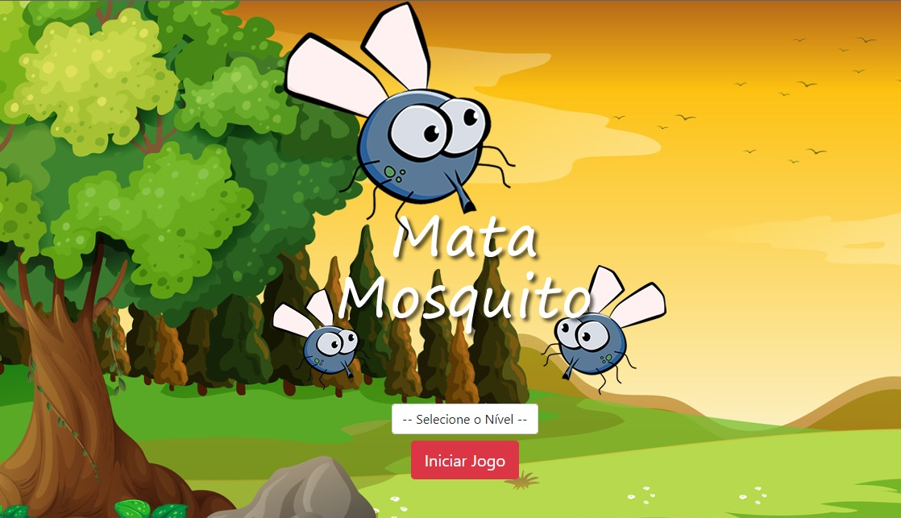

# App Kills Mosquito

Welcome! 

This repository contains a sensational game developed to train knowledge of programming logic and Javascript.

This project was developed during the [Complete Web Development](https://www.udemy.com/course/web-completo/) course (Section Javascript) held at UDEMY.

* Home Page



# 🧠 About

The goal with this project is learn and practice about this functionalities below:

- [x] Arrays
- [x] Length
- [x] Array - Element inclusion and exclusion methods
- [x] Array - Search method
- [x] Array - Ordering elements
- [x] While
- [x] Do while
- [x] For
- [x] For in
- [x] Foreach
- [x] Try, catch, throw and finally
- [x] BOM (Window, Screen, Location, Timing)

## 🖥️ Installation

1. Clone this repo
```bash
git clone https://github.com/robernar2011/KillsMosquito.git
```
